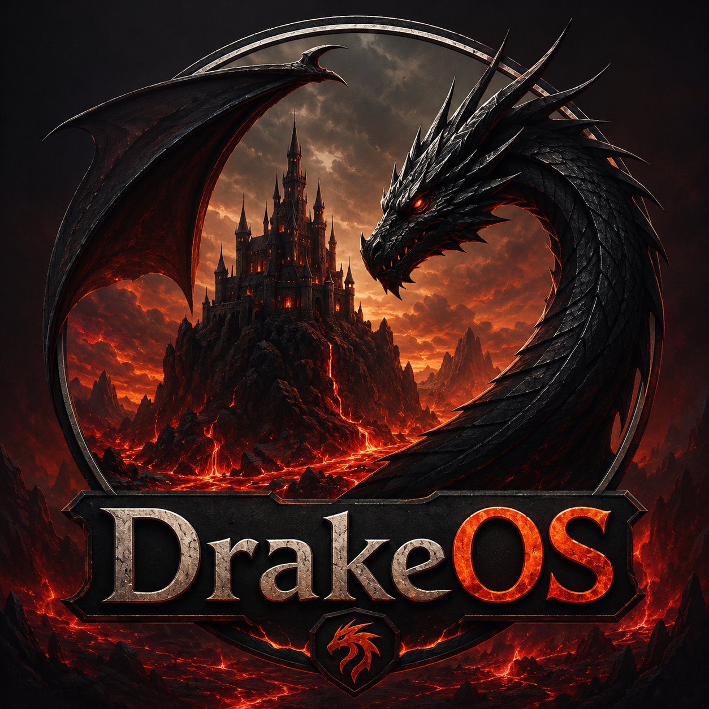

# DrakeOS

A 32-bit x86 teaching operating system: its own BIOS bootloader and GRUB support,
higher-half paging, preemptive multitasking, ring-3 programs with system calls, a VFS,
VGA text and graphics, and drivers for the usual PC hardware, in small readable C and NASM.



## Features

| Area | What DrakeOS does |
|---|---|
| Boot | Its own two-stage BIOS bootloader (A20, E820 memory map, LBA/CHS disk loading, protected-mode switch, Multiboot hand-off) **and** GRUB 2 via Multiboot. QEMU's `-kernel` also works. |
| CPU | GDT with ring-0/ring-3 segments and a TSS, IDT with all exceptions, 8259 PIC remapped to 32–47, PIT at 100 Hz. |
| Memory | Bitmap page-frame allocator from the BIOS map, higher-half kernel at 0xC0000000, per-process page directories, first-fit kernel heap. |
| Processes | Preemptive round-robin scheduler, kernel threads, ring-3 user processes loaded from ELF, `exec`/`wait`/`exit`, sleeping, blocking I/O, kill. |
| System calls | `int 0x80`: exit, write, read, yield, getpid, sleep, open, close, exec, wait. User pointers are validated. |
| Files | VFS with a read-only initrd built into the kernel (`/`), DrakeFS on a data disk (`/disk`), and `/dev/console`. |
| Drivers | VGA text console with scrolling and a hardware cursor, serial logging (COM1), PS/2 keyboard and mouse, ATA PIO, PC speaker, VGA mode 13h graphics set through the registers, with the font and palette saved and restored. |
| Shell | History, Ctrl+C/Ctrl+L, and 27 commands: files, processes, `gfx`, `logo`, `paint` (mouse), `beep`/`play`, `hi`, `vid`, `reboot`, `shutdown`. |
| User space | crt0 + a small libc (`printf`, strings, syscall wrappers) and 7 programs: `hello`, `ticker`, `spin`, `fault`, `ucat`, `greet`, `spawn`. |

## Requirements (Arch Linux)

```sh
sudo pacman -S qemu-system-x86 nasm grub xorriso mtools gdb base-devel python
yay -S i686-elf-gcc i686-elf-binutils     # optional: the cross compiler
```

Without `i686-elf-gcc` the Makefile uses the host `gcc` in 32-bit freestanding mode
(`-m32 -ffreestanding -nostdinc`); it only needs the 32-bit `libgcc`, which Arch's gcc ships.
Regenerating the logo asset (`tools/mklogo.py`) needs Pillow; the generated
`assets/drakelogo.bin` is committed, so normal builds do not.

## Build and run

```sh
make                 # build/drakeos.img (own bootloader), build/drakeos.iso (GRUB), build/data.img
make run             # boot the disk image with the DrakeOS bootloader
make run-grub        # boot the ISO through GRUB
make run-direct      # QEMU's built-in Multiboot loader
make debug           # QEMU stopped at reset + gdb with kernel symbols (breaks at kmain)
make test            # headless end-to-end tests on both boot paths
make help            # all targets and variables
```

The serial log appears in the terminal. `AUDIO=pa|pipewire|alsa|none` selects the PC-speaker
backend (default `pa`). The data disk `build/data.img` survives `make clean`; run `format`
once in the shell to create DrakeFS on it.

Everything runs inside QEMU; the images are never booted on the host.

## A tour

```
drake> ls                     initrd files, plus the dev/ and disk/ mount points
drake> run hello a b          ring-3 program printing its argv
drake> run ticker 20 &        background process; it keeps printing while you type
drake> ps                     process table
drake> run spin 2             busy loop without yield: the ticker still runs (preemption)
drake> run fault              writes kernel memory -> page fault -> only the process dies
drake> run fault cli          privileged instruction in ring 3 -> general protection fault
drake> format                 create DrakeFS on the data disk
drake> write note hello disk  then: cat disk/note, ls disk, rm disk/note
drake> run greet              read() from the keyboard
drake> logo / gfx / paint     mode 13h; paint uses the PS/2 mouse (Esc to quit)
drake> beep 440 300 / play    PC speaker
```

## Layout

```
boot/          stage1.asm (boot sector), stage2.asm (A20, E820, loader, PM switch), grub.cfg
kernel/
  arch/i386/   boot.asm (Multiboot entry, higher-half jump), GDT/TSS, IDT, stubs, PIC, PIT, context switch
  mm/          pmm.c (frames), vmm.c (paging), heap.c (kmalloc)
  proc/        process.c (scheduler, threads, processes), elf.c, syscall.c
  drivers/     vga, serial, keyboard, mouse, speaker, gfx (mode 13h), ata
  fs/          vfs.c, initrd.c, drakefs.c
  shell/       shell.c (line editing), commands.c
  lib/         string, printf, console (kprintf/klog/panic)
user/          crt0, libc, syscall wrappers, programs/
rootfs/        text files packed into the initrd
tools/         mkinitrd.c, mklogo.py, gdbinit
tests/         boot_test.py
docs/          architecture.md
```

See [docs/architecture.md](docs/architecture.md) for the boot flow, memory map and design.

## License

GPL-3.0, see [LICENSE](LICENSE).
